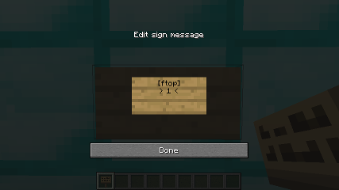
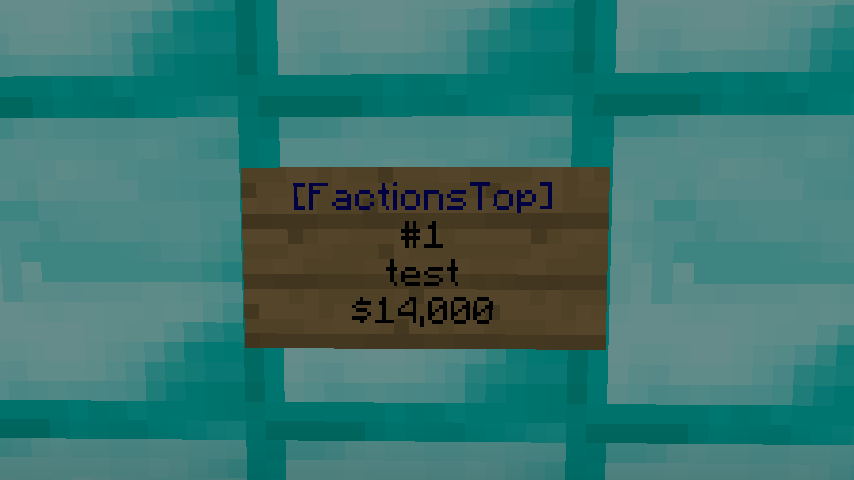

# Novucs' FactionsTop
An efficient and comprehensive factions ranking system.

This Bukkit plugin adds a command to the well known factions plugin to display all factions on the server, ordered by wealth. The wealth of a faction is determined by calculating the value of all blocks stored in the faction claims and chests. This specific implementation aims to provide real-time results while still maintaining a good performance. A demonstration of this plugin in action is shown in this video: https://youtu.be/f9WWFT5tZaI

## Supports
* Spigot 1.7.x -> 1.10.x
* FactionsUUID by drtshock
* MassiveCore Factions 2.7+
* H2 and MySQL

## Usage
### Commands
| **Command**  | **Description**            |
| -------------| ---------------------------|
| /ftop <page> | List all top factions      |
| /ftop reload | Reload the plugin settings |

### Signs
Signs can be used to display a faction at a specific rank. Example:

### Permissions
| **Permission**         | **Description**                 | **Default** |
| -----------------------| ------------------------------- | ----------- |
| factionstop.use        | List all top factions           | everyone    |
| factionstop.reload     | Reload the plugin settings      | operator    |
| factionstop.sign.break | Break FactionsTop ranking signs | operator    |
| factionstop.sign.place | Place FactionsTop ranking signs | operator    |